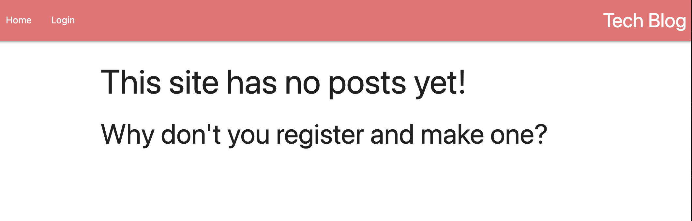

# Tech Blog

This is a somewhat-functional Express.js API that uses MySQL and Sequelize to perform CRUD commands, with a front end built with Handlebars.

* [Installation Guide](#Installation)
* [How to Use](#Usage)
* [Example Screenshots](#Screenshots)
* [License](#License)
* [Contact Info](#Contact)

## Installation
No installation required - this is hosted live on [Heroku](https://bloggerrrati.herokuapp.com/).

## Usage
Once you make an account, you are supposed to be able to create posts, add comments, and view your posts on your dashboard. However, I struggled a lot with this homework. I'll definetly be coming back to this one when I understand this better.

## Screenshots:

### Homepage

### Login Page

### Register Page

### Dashboard Page

### New Post Page

## License
This project is licensed under the MIT license.

©[corgimaman](https://github.com/corgimaman)

## Contact
Questions? Comments? Feel free to reach out to me at helloidaworld@gmail.com or on [GitHub](https://github.com/corgimaman).